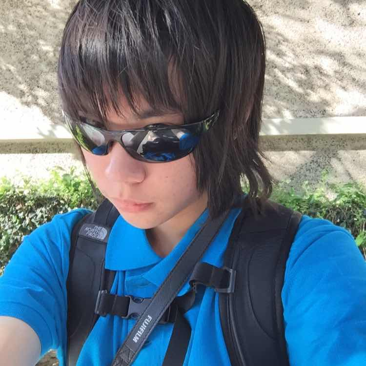

## `whoami`?

A PhD student at [University of Rochester, CS Department](https://cs.rochester.edu/).
Currently working with [Prof. Sreepathi Pai](https://cs.rochester.edu/~sree/).

## Education Background
* Current PhD student at University of Rochester, Computer Science Department
* Master of Science in Computer Engineering at Columbia University
* Bachelor of Science in Electrical Engineering at University of Southern California

## Research Projects

## Other Projects
* [Mad Scientist Carl's Core](https://github.com/rongcuid/MSCC)
    * An early branch, 2-stage, RISC-V RV32I M-privilege softcore on Artix-7
    * Verilator + SystemC, fully compliant

## Publications